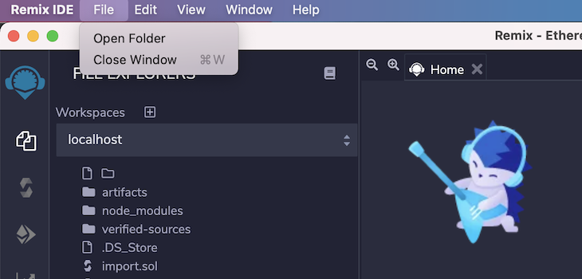

# Remix Desktop
**Remix Desktop** is an Electron version of Remix IDE.  It works on Linux, Windows, & Macs.

Like the name says, it is a desktop app - so it you can seamlessly access files on your computer's filesystem.  

To find out more about Remix IDE - please go to [ethereum/remix-project](https://github.com/ethereum/remix-project) - or to see it in action, go to [remix.ethereum.org](https://remix.ethereum.org).

### Download
To download Remix Desktop, see releases: [https://github.com/ethereum/remix-desktop/releases](https://github.com/ethereum/remix-desktop/releases)

## Differences between Remix Desktop & Remix IDE - the web app
### Accessing your hard drive
**Remix IDE - the web app** works in a browser and without using [remixd](https://remix-ide.readthedocs.io/en/latest/remixd.html), it cannot access your computer's file system. Whereas with **Remix Desktop** accessing your filesystem is easy. 

Saving and accessing files saved on your computer are the big advantage of Remix Desktop.

In Remix Desktop, you select a folder from the File menu (File -> Open Folder) to make it the active folder in the **File Explorers'** workspace.  Go to File -> Open Folder to select.

### Version control & folder capacity
With Remix Desktop, version control is just like it would be with any other desktop IDE. Similarly the size of a workspace folder is limited by your computer's hard drive.  In Remix IDE - the web app, the size of a workspace folder is limited by the size of the browser's local storage. There are techniques for putting version control in the browser (like using remixd or the DGIT plugin), but these are work-arounds to inherent limitations of a browser. 

### Deploying to a public testnet with Injected Web3 & Metamask
**Remix Desktop** does not have access to the Metamask - the browser plugin - so deploying to a public chain currently involves using the Wallet Connect plugin.  In contrast, **Remix IDE - the web app** has easy access to the Metamask browser plugin.

## Updates to Remix IDE & Updates to Remix Desktop
Please check subscribe to our Twitter feed @EthereumRemix - so we can prompt you to download the latest version.  Remix Desktop is a wrapper of Remix IDE so Remix Desktop will automatically grab the latest version of Remix IDE.  You only need to download the new releases of Remix Desktop.  We also post announcements in our gitter chat: https://gitter.im/ethereum/remix

## Where to go to for help
Please post your questions to: https://gitter.im/ethereum/remix

## Reporting issues
For posting issues - you can alert us in the gitter chat - or post the issue to this repo.
